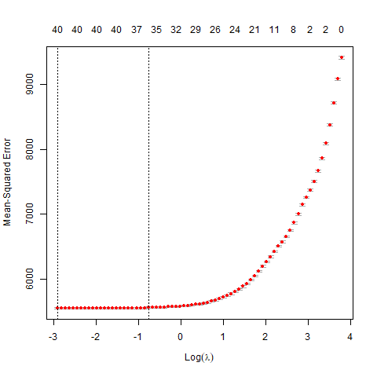
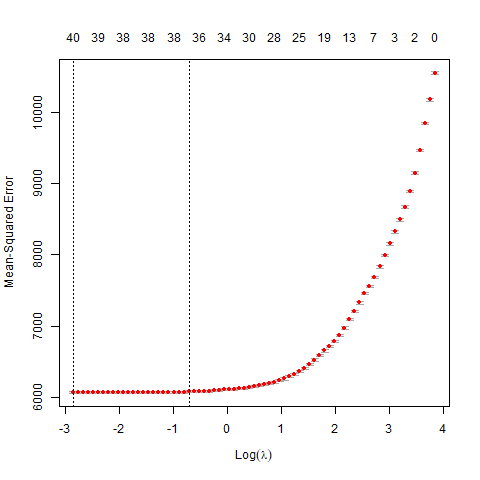
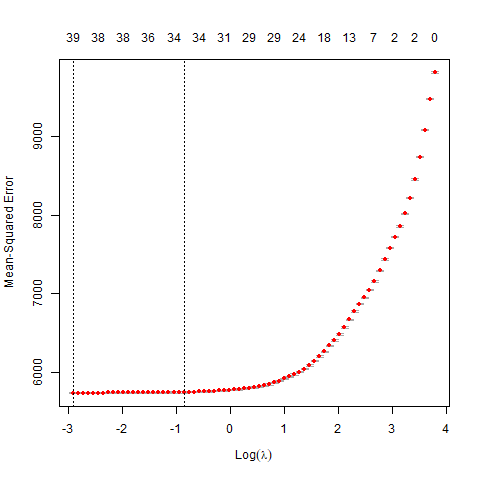
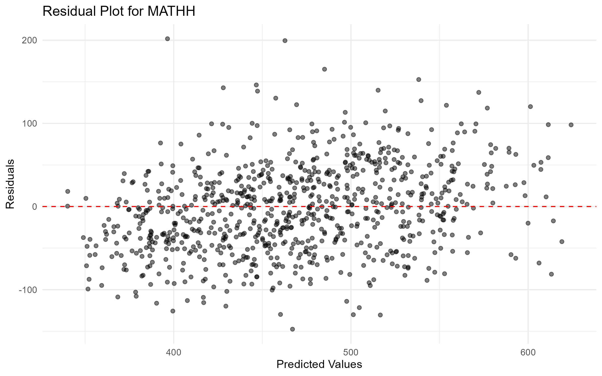
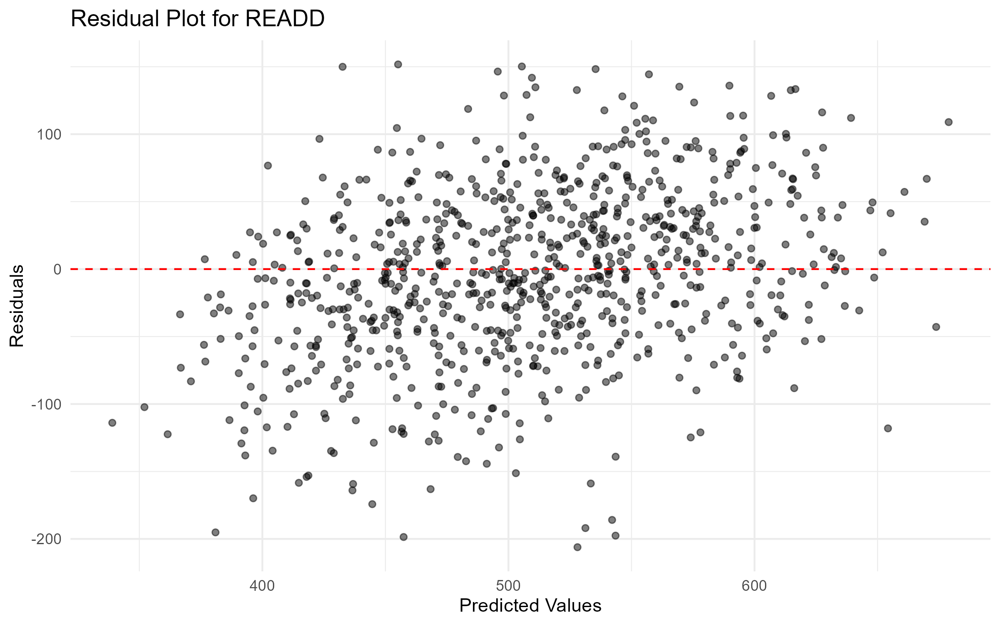
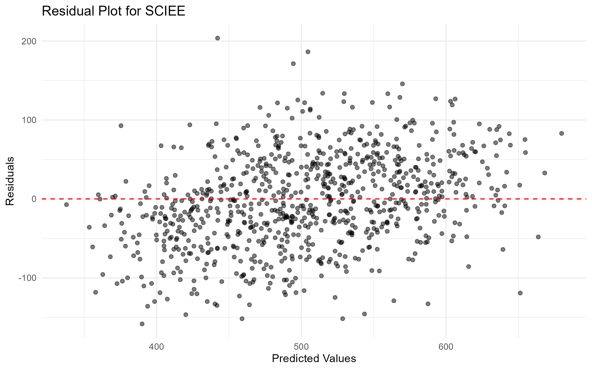

# PISA 2022 Predictive Modeling (LASSO + KNN)

LASSO regression for SES variable selection and KNN regression for academic outcome prediction using PISA 2022 data.

## What this covers
- LASSO regression to identify the strongest SES predictors of math, reading, and science scores across 79 countries
- KNN regression to predict academic outcomes using U.S. student data
- 10-fold cross-validation for hyperparameter tuning
- Model evaluation using RMSE, R², and MAE with residual plots

## LASSO Cross-Validation Plots
The optimal lambda minimizes cross-validated MSE. Parental doctoral education was the strongest positive predictor across all subjects; digital device ownership showed consistent negative associations.

| Subject | Plot |
|---------|------|
| Math |  |
| Reading |  |
| Science |  |

## KNN Residual Plots
Residuals are plotted against predicted values. Points scattered randomly around zero indicate a well-fitted model.

| Subject | Plot |
|---------|------|
| Math |  |
| Reading |  |
| Science |  |

## Model Performance

| Subject | RMSE | R² | MAE |
|---------|------|----|-----|
| Math | 52.6 | 0.689 | 42.2 |
| Reading | 63.5 | 0.676 | 50.2 |
| Science | 58.5 | 0.717 | 47.0 |

## Data
Requires `imputed_variables.rds` produced by:
[pisa2022-data-preparation-eda](https://github.com/RumeysaGorgulu/pisa2022-data-preparation-eda)

## Requirements
```r
install.packages(c("tidyverse", "glmnet", "tidymodels", "kknn"))
```

## Author
Rumeysa Gorgulu
